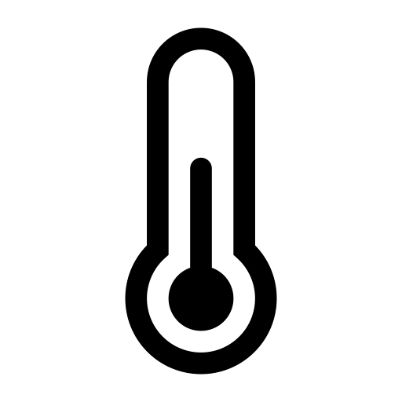
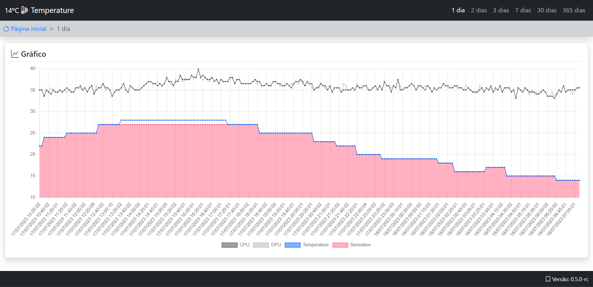
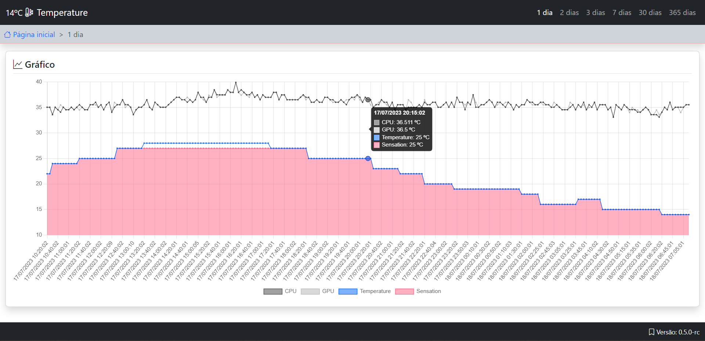
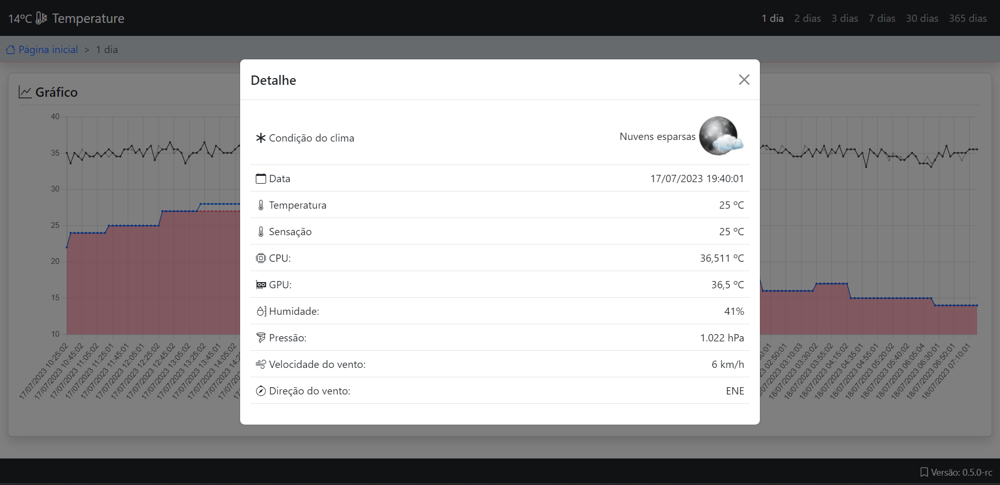

<h1 align="center">
  
  <br />
  Temperature
</h1>

<p align="center"><i>"It collects the temperature of your city from the Climatempo.com.br API."</i></p>
<p align="center"><i>"Coleta a temperatura da sua cidade da api do Climatempo.com.br."</i></p>

<a href="https://github.com/leorm037/temperature/fork"></a> 


## Print screen | Captura de telas
<p align="center">
  
  
  
</p>

## Tradução
```
php bin/console translation:extract --force --dump-messages --format=yaml --sort=asc pt_BR
```
